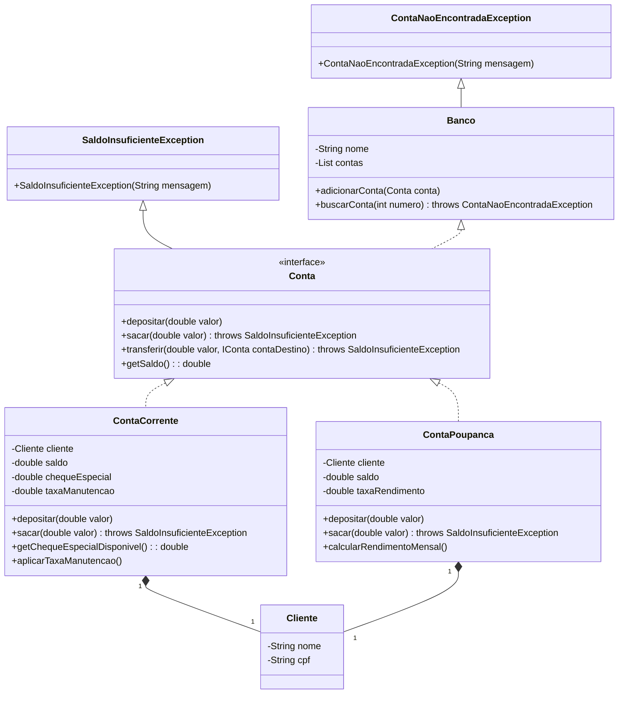

# Projeto Banco Digital - Desafio DIO

Este projeto é um desafio da DIO para aprimorar habilidades em programação orientada a objetos (POO) criando um sistema simples de banco digital. O projeto envolve a implementação de várias operações bancárias usando Java e a aplicação dos princípios da POO.

## Descrição do Projeto
O objetivo deste projeto é simular um sistema de banco digital onde os clientes podem criar contas, realizar depósitos, saques e consultar seus saldos. O sistema suporta diferentes tipos de contas: contas correntes *(ContaCorrente)* e contas poupança *(ContaPoupanca)*. Cada tipo de conta possui métodos e comportamentos específicos.

### Princípios da POO Aplicados
1. **Abstração**: O projeto abstrai o conceito de uma conta bancária em uma interface genérica Conta, que é implementada por tipos específicos de contas (ContaCorrente e ContaPoupanca).
2. **Encapsulamento**: Os detalhes e operações das contas são encapsulados dentro das respectivas classes, garantindo que o estado interno de um objeto esteja oculto do exterior.
3. **Herança**: O projeto usa herança para criar tipos especializados de contas a partir da interface base Conta.
4. **Polimorfismo**: O projeto demonstra polimorfismo usando uma interface comum Conta para interagir com diferentes tipos de contas. O tipo real da conta é determinado em tempo de execução usando o operador instanceof.

 
 

 
 

### Detalhes da Implementação
1. **Interface Conta**: Define os métodos depositar, sacar e getSaldo.
2. **Classe ContaCorrente**: Implementa a interface Conta e adiciona atributos e métodos específicos para contas correntes, como chequeEspecial e aplicarTaxaManutencao.
3. **Classe ContaPoupanca**: Implementa a interface Conta e adiciona atributos e métodos específicos para contas poupança, como taxaRendimento e calcularRendimentoMensal.
4. **Classe Cliente**: Representa um cliente do banco com os atributos nome e cpf.
5. **Classe SaldoInsuficienteException**: Classe de exceção personalizada para lidar com cenários de saldo insuficiente e conta não encontrada.

### Dependências
O projeto usa Lombok para reduzir o código "boilerplate".

## Conclusão
Este projeto demonstra a aplicação dos princípios da POO em um cenário prático, criando um sistema de banco digital. Ele cobre abstração, encapsulamento, herança e polimorfismo, fornecendo uma base sólida para entender e implementar conceitos de POO em Java.
